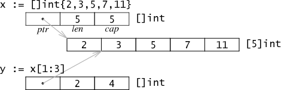

### slice (切片)
切片（slice）是对数组一个连续片段的引用（该数组我们称之为相关数组，通常是匿名的），
所以切片是一个引用类型（类似于 C/C++ 中的数组类型，或者 Python 中的 list 类型）

> 一个slice是一个数组某个部分的引用。
>
> 在内存中，它是一个包含3个域的结构体：指向匿名数组第一个元素的指针，长度，以及容量。
>
> 长度是下标操作的上界，如x[i]中i必须小于长度。
>
> 容量是分割操作的上界，如x[i:j]中j不能大于容量。

 

#### 内部结构
在`$GOROOT/src/pkg/runtime/runtime.h`中可以看到它的定义：
```go
struct    Slice
{    // must not move anything
    byte*    array;        // actual data
    uintgo    len;        // number of elements
    uintgo    cap;        // allocated number of elements
};

```

这个结构体包含了三个元素：

* 一个指针，指向数组中slice指定的开始位置
* 长度（len），即slice的长度
* 容量（cap），也就是slice开始位置到数组的最后位置的长度


```go
package main

import (
    "fmt"
)

func main() {
	Array_a := [10]byte{'a', 'b', 'c', 'd', 'e', 'f', 'g', 'h', 'i', 'j'}
	Slice_a := Array_a[2:5]

    fmt.Println(len(Slice_a), cap(Slice_a))
}
```
输出：
```go
3 8
```

#### 迭代切片

我们可以使用 for range 循环来迭代它，打印其中的每个元素以及对应的索引。
```go
slice := []int{1, 2, 3, 4, 5} 
for i,v:=range slice{
    fmt.Printf("索引:%d,值:%d\n",i,v)
}
```
需要说明的是`range`返回的是切片元素的复制，而不是元素的引用。

使用传统的for循环：
```go
slice := []int{1, 2, 3, 4, 5}
for i := 0; i < len(slice); i++ {
    fmt.Printf("值:%d\n", slice[i])
}
```

#### 自动扩容
在对`slice`进行`append`等操作时，超过容量时会造成`slice`的自动扩容。其扩容时的大小增长规则是：

- 如果新的大小是当前大小2倍以上，则大小增长为新大小
- 否则循环以下操作：如果当前大小小于1024，按每次2倍增长，否则每次按当前大小1/4增长。直到增长的大小超过或等于新大小。

```go
package main                                                  
                                                              
import (                                                      
    "fmt"                                                     
                                                              
)                                                             
                                                              
func main() {                                                 
    Array_a := [10]byte{'a', 'b', 'c', 'd', 'e', 'f', 'g', 'h', 'i', 'j'}
    Slice_a := Array_a[2:5]                                   
                                                              
    fmt.Println(len(Slice_a), cap(Slice_a), string(Slice_a), &Slice_a[0])                                                                                     
                                                              
    Slice_b := []byte{'a', 'b', 'c', 'd', 'e', 'f', 'g', 'h'}
    Slice_a = append(Slice_a, Slice_b...)                     
                                                              
    fmt.Println(len(Slice_a), cap(Slice_a), string(Slice_a), &Slice_a[0])
                                                              
}
```

输出：
```go
3 8 cde 0xc000014112
11 16 cdeabcdefgh 0xc000014130
```
> 
> 大批量添加数据时，建议一次性分配足够大的空间，以减少内存分配和数据复制开销。
> 
> 或初始化足够长的 len 属性，改用索引号进行操作。
> 
>及时释放不再使用的 slice 对象，避免持有过期数组，造成 GC 无法回收
> 


#### 函数间传递切片
切片是3个字段构成的结构类型，所以在函数间以值的方式传递的时候，占用的内存非常小，成本很低。
在传递复制切片的时候，其底层数组不会被复制，也不会受影响，复制只是复制的切片本身，不涉及底层数组。

```go
func main() {
    slice := []int{1, 2, 3, 4, 5}
    fmt.Printf("main step1 %p\n", &slice)
    modify(slice)
    fmt.Printf("main step2 %p\n", &slice)
    fmt.Println(slice)
}
func modify(slice []int) {
    fmt.Printf("modify %p\n", &slice)
    slice[1] = 10
}
```

输出：
```go
main step1 0xc00000c080
modify 0xc00000c0a0
main step2 0xc00000c080
[1 10 3 4 5]
```
两个切片的地址不一样，所以可以确认切片在函数间传递是复制的。而我们修改一个索引的值后，发现原切片的值也被修改了，说明它们共用一个底层数组。

思考下面会输出啥？
```go
func main() {
    slice := []int{1, 2, 3, 4, 5}
    modify(slice)
    fmt.Println(slice)
}
func modify(slice []int) {
    slice[1] = 10 // [1 10 3 4 5]
    slice = append(slice, 10) // 局部slice触发自动扩容 底层不再指向同一个匿名数组
    slice[1] = 5 // [1 10 3 4 5]
}
```


#### 切片拷贝和追加
`copy`: 切片复制
`append`: 追加

```go
package main

import (
	"fmt"
)

func main() {

	s1 := []int{1, 2, 3, 4, 5}
	fmt.Printf("slice s1 : %v\n", s1)
	s2 := make([]int, 10)
	fmt.Printf("slice s2 : %v\n", s2)
	copy(s2, s1)
	fmt.Printf("copied slice s1 : %v\n", s1)
	fmt.Printf("copied slice s2 : %v\n", s2)
	s3 := []int{1, 2, 3}
	fmt.Printf("slice s3 : %v\n", s3)
	s3 = append(s3, s2...)
	fmt.Printf("appended slice s3 : %v\n", s3)
	s3 = append(s3, 4, 5, 6)
	fmt.Printf("last slice s3 : %v\n", s3)

}
```

输出：
```go
slice s1 : [1 2 3 4 5]
slice s2 : [0 0 0 0 0 0 0 0 0 0]
copied slice s1 : [1 2 3 4 5]
copied slice s2 : [1 2 3 4 5 0 0 0 0 0]
slice s3 : [1 2 3]
appended slice s3 : [1 2 3 1 2 3 4 5 0 0 0 0 0]
last slice s3 : [1 2 3 1 2 3 4 5 0 0 0 0 0 4 5 6]
```

`copy` ：函数 `copy` 在两个 `slice` 间复制数据，复制长度以 `len` 小的为准。两个 `slice` 可指向同一底层数组，允许元素区间重叠。

```go
package main

import (
	"fmt"
)

func main() {

	data := [...]int{0, 1, 2, 3, 4, 5, 6, 7, 8, 9}
	fmt.Println("array data : ", data)
	s1 := data[8:]
	s2 := data[:5]
	fmt.Printf("slice s1 : %v\n", s1)
	fmt.Printf("slice s2 : %v\n", s2)
	copy(s2, s1)
	fmt.Printf("copied slice s1 : %v\n", s1)
	fmt.Printf("copied slice s2 : %v\n", s2)
	fmt.Println("last array data : ", data)

}
```

#### 字符号和切片
`string`底层就是一个`byte`的数组，因此，也可以进行切片操作。

```go
package main

import (
	"fmt"
)

func main() {
	str := "hello world"
	s1 := str[0:5]
	fmt.Println(s1)

	s2 := str[6:]
	fmt.Println(s2)
}

```
输出：

```go
hello
world
```

`string`本身是不可变的，可以将其转换成`[]rune`或`[]byte`操作：
```go
package main

import (
	"fmt"
)

func main() {
	str := "Hello world"
	s := []byte(str) //中文字符需要用[]rune(str)
	s[6] = 'G'
	s = s[:8]
	s = append(s, '!')
	str = string(s)
	fmt.Println(str)
}
```