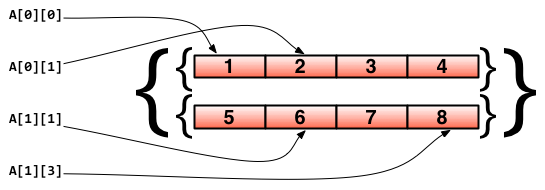

## array(数组)

数组是长度固定的数据类型，存储一段相同类型的元素，而且这些元素是连续的内存；
声明的格式是：
```go
var identifier [len]type
```
> len表示数组的长度，type表示存储元素的类型。对数组的操作和其它语言类似，都是通过[]来进行读取或赋值：

如：
```go
var arr [5]int  // 声明了一个int类型的数组
arr[0] = 42      // 数组下标是从0开始的
arr[1] = 13      // 赋值操作

fmt.Printf("The first element is %d\n", arr[0])  // 获取数据，返回42
fmt.Printf("The last element is %d\n", arr[9]) //返回未赋值的最后一个元素，默认返回0
```
> 数组array里面的值会初始化对应元素类型的零值，也就是说，[10]int数组是10个0

> 由于长度也是数组类型的一部分，因此[3]int与[4]int是不同的类型，数组也就不能改变长度。

> 数组之间的赋值是值的赋值，传入的其实是该数组的副本，而不是它的指针。值拷贝行为会造成性能问题，通常会建议使用 slice，或数组指针。

```go
package main

import (
    "fmt"
)

func test(x [2]int) {
    fmt.Printf("x: %p\n", &x)
    x[1] = 1000
}

func main() {
    a := [2]int{}
    fmt.Printf("a: %p\n", &a)

    test(a)
    fmt.Println(a)
}
```
输出：
```go
a: 0xc42007c010
x: 0xc42007c030
[0 0]
```

### 短声明
```go
a := [3]int{1, 2, 3} // 声明了一个长度为3的int数组

b := [10]int{1, 2, 3} // 声明了一个长度为10的int数组，其中前三个元素初始化为1、2、3，其它默认为0

c := [...]int{4, 5, 6} // 可以省略长度而采用`...`的方式，Go会自动根据元素个数来计算长度
```
### 多维数组
```go
// 声明了一个二维数组，该数组以两个数组作为元素，其中每个数组中又有4个int类型的元素
doubleArray := [2][4]int{[4]int{1, 2, 3, 4}, [4]int{5, 6, 7, 8}}

// 上面的声明可以简化，直接忽略内部的类型
easyArray := [2][4]int{{1, 2, 3, 4}, {5, 6, 7, 8}}
```

> 多维数组内存分配如下：
 


### 使用数组

内置函数 `len`(长度) 和 `cap`(容量) 都返回数组长度 (元素数量)，`len`(长度) 和 `cap`(容量)对`array`没有区别，对`slice`有很大的不同，后续我们会提到
```go
package main

func main() {
	a := [2]int{}
	println(len(a), cap(a)) 
}
```
输出：
```go
2 2
```

如果我们要循环打印数组中的所有值，一个传统的就是常用的for循环：
```go
func main() {
    array := [5]int{1: 1, 3: 4}
    
    for i := 0; i < len(array); i++ {
        fmt.Printf("索引:%d,值:%d\n", i, array[i])
    }
}
```

大部分时候，我们都是使用for rang循环:
```go
func main() {
    array := [5]int{1: 1, 3: 4}   
    
    for i, v := range array {
        fmt.Printf("索引:%d,值:%d\n", i, v)
    }
}
```

