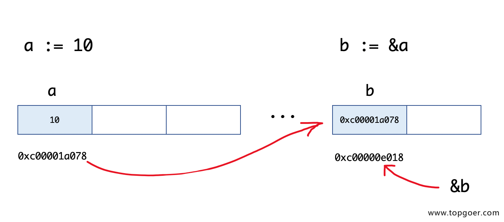

## pointer(指针)

Go语言中的函数传参都是值拷贝，当修改某个变量的时候，可以创建一个指向该变量地址的指针变量。
传递数据使用指针，而无须拷贝数据。

类型指针不能进行偏移和运算，是安全指针。

Go语言中的指针操作非常简单，只需要记住两个符号：&（取地址）和*（根据地址取值）。

Golang 支持指针类型 *T，指针的指针 **T，以及包含包名前缀的 *.T。

### 指针地址和指针类型

每个变量在运行时都拥有一个地址，这个地址代表变量在内存中的位置。

使用&字符放在变量前面对变量进行“取地址”操作

值类型（int、float、bool、string、array、struct）都有对应的指针类型，如：*int、*int64、*string等。

```go
func main() {
    a := 10
    b := &a
    fmt.Printf("a:%d ptr:%p\n", a, &a) // a:10 ptr:0xc00001a078
    fmt.Printf("b:%p type:%T\n", b, b) // b:0xc00001a078 type:*int
    fmt.Println(&b)                    // 0xc00000e018
}
```


### 指针取值

指针取值：普通变量使用`&`操作符会获得这个变量的指针，然后对指针使用`*`操作
```go
func main() {
    //指针取值
    a := 10
    b := &a // 取变量a的地址，将指针保存到b中
    fmt.Printf("type of b:%T\n", b)
    c := *b // 指针取值（根据指针去内存取值）
    fmt.Printf("type of c:%T\n", c)
    fmt.Printf("value of c:%v\n", c)
}
```

输出：
```go
type of b:*int
type of c:int
value of c:10
```

> 取地址操作符&和取值操作符*是一对互补操作符，&取出地址，*根据地址取出地址指向的值

```go
func modify1(x int) {
    x = 100
}

func modify2(x *int) {
    *x = 100
}

func main() {
    a := 10
    modify1(a)
    fmt.Println(a) // 10
    modify2(&a)
    fmt.Println(a) // 100
}
```

### 空指针

当一个指针被定义后没有分配到任何变量时，它的值为 nil
```go
package main

import "fmt"

func main() {
    var p *string
    fmt.Println(p)
    fmt.Printf("p的值是%v\n", p)
    if p != nil {
        fmt.Println("非空")
    } else {
        fmt.Println("空值")
    }
}
```


### new 和 make

看个例子：
```go
func main() {
    var a *int
    *a = 100
    fmt.Println(*a)

    var b map[string]int
    b["测试"] = 100
    fmt.Println(b)
}
```
执行上面的代码会引发panic，
由于在Go语言中对于引用类型的变量，在使用时不仅要声明，还要为它分配内存空间，否则值没办法存储。而对于值类型在声明的时候已经默认分配好了内存空间

内存分配：

- new(T)分配了零值填充的T类型的内存空间，并且返回其地址，即一个*T类型的值, 返回的是指针
- make 会被编译器翻译 成具体的创建函数，由其分配内存和初始化成员结构（填充初始化的非零值），返回对象而非指针。

```go
package main

func main() {
	a := []int{0, 0, 0} // 提供初始化表达式。
	a[1] = 10

	b := make([]int, 3) // make slice
	b[1] = 10

	c := new([]int)
	c[1] = 10 // ./main.go:11:3: invalid operation: c[1] (type *[]int does not support indexing)

	var m map[string]int
	m["测试"] = 100 // panic 引用类型不仅要声明它，还要为它分配内存空间，否则我们的值就没办法存储
}
```

new和make的区别：
```go
make 用来创建`map`、`slice`、`channel`等引用类型 

new 用来创建值类型(如`array`, `struct`) 和 用户定义的类型

new 和 make 均是用于分配内存

```

make和new对应底层的内存分配：


#### 备注
关于“零值”，所指并非是空值，而是一种“变量未填充前”的默认值，通常为0。 此处罗列 部分类型 的 “零值”
```go
int     0
int8    0
int32   0
int64   0
uint    0x0
rune    0 //rune的实际类型是 int32
byte    0x0 // byte的实际类型是 uint8
float32 0 //长度为 4 byte
float64 0 //长度为 8 byte
bool    false
string  ""
```