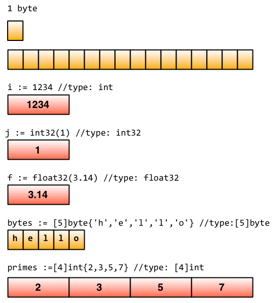

## 常用类型

### 整型
整型分为以下两个大类： 
- 按长度分为：int8、int16、int32、int64
- 对应的无符号整型：uint8、uint16、uint32、uint64
- uint8就是我们熟知的byte型，int16对应C语言中的short型，int64对应C语言中的long型。
- 类型的变量之间不允许互相赋值或操作，除非显式的强制转换，不然会在编译时引起编译器报错

```go
var a int8
var b int32

c := a + b // 产生错误：invalid operation: a + b (mismatched types int8 and int32)
c := int32(a) + b
```

### 浮点型
Go语言支持两种浮点型数：`float32` 和 `float64` (没有`float`类型)，默认是float64
- float32 的浮点数的最大范围约为3.4e38，可以使用常量定义：math.MaxFloat32。 
- float64 的浮点数的最大范围约为 1.8e308，可以使用一个常量定义：math.MaxFloat64。

```go
package main

import (
	"fmt"
	"reflect"
)

func main() {
	var i int = 42
	fmt.Printf("i value is : %v , type is : %v \n", i, reflect.TypeOf(i))
	var f float64 = float64(i)
	fmt.Printf("f value is : %v , type is : %v \n", f, reflect.TypeOf(f))
	var u uint = uint(f)
	fmt.Printf("u value is : %v , type is : %v \n", u, reflect.TypeOf(u))
}
```

### 复数

`complex64`和`complex128`
复数有实部和虚部，complex64的实部和虚部为32位，complex128的实部和虚部为64位。

复数使用 re+imI 来表示，其中 re 代表实数部分，im 代表虚数部分，I 代表根号负 1。
```go
var c1 complex64 = 5 + 10i
fmt.Printf("The value is: %v", c1)
// 输出： 5 + 10i

```
函数 real(c) 和 imag(c) 可以分别获得相应的实数和虚数部分。

### 布尔值
Go语言中以bool类型进行声明布尔型数据，布尔型数据只有true（真）和false（假）两个值。

注意：
- 布尔类型变量的默认值为false。
- Go 语言中不允许将整型强制转换为布尔型.
- 布尔型无法参与数值运算，也无法与其他类型进行转换。

```go
var isActive bool  // 全局变量声明
var enabled, disabled = true, false  // 忽略类型的声明
func test() {
    var available bool  // 一般声明
    valid := false      // 简短声明
    available = true    // 赋值操作

    a := 100
    if a { // Error: non-bool a (type int) used as if condition
        println("true")
    }
}
```

### 错误类型
Go内置有一个error类型，专门用来处理错误信息，Go的`package`里面还专门有一个包`errors`来处理错误：
```go
err := errors.New("emit macho dwarf: elf header corrupted")
if err != nil {
    fmt.Print(err)
}
```

### 数据的底层存储
基础类型底层都是分配了一块内存，然后存储了相应的值。想要了解更多可以移步[Go数据结构](https://research.swtch.com/godata)


> 变量i属于类型int，在内存中用一个32位字长(word)表示

> 变量j由于做了精确的转换，属于int32类型。尽管i和j有着相同的内存布局，但是它们属于不同的类型：赋值操作 i = j 是一种类型错误，必须写成更精确的转换方式：i = int(j)。

> 变量f属于float类型，Go语言当前使用32位浮点型值表示(float32)。它与int32很像，但是内部实现不同。

> 变量bytes的类型是[5]byte，一个由5个字节组成的数组。它的内存表示就是连起来的5个字节，就像C的数组。

> 类似地，变量primes是4个int的数组。

