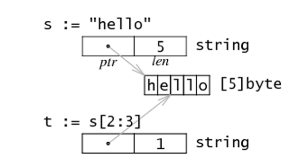

### 字符串

Go 语言里的字符串的内部实现使用UTF-8编码，可以在Go语言的源码中直接添加非ASCII码字符。字符串是用一对双引号（""）或反引号（``）括起来定义
```go
s1 := `hello`
s2 := "你好"
```

> • 默认值是空字符串 ""。

> • 用索引号访问某字节，如 s[i]

> • 不能用序号获取字节元素指针，&s[i] 非法

> • 不可变类型，无法修改字节数组

> • 字节数组尾部不包含 NULL

```go
package main

func main() {
	s := "abc"
	println(s[0] == '\x61', s[1] == 'b', s[2] == 0x63)
}

```
输出结果:
```go
true true true
```

#### 字符串转义符
Go 语言的字符串常见转义符包含回车、换行、单双引号、制表符等

|转义	| 含义
|------ |------
|\r	    | 回车符（返回行首）
|\n	    | 换行符（直接跳到下一行的同列位置）
|\t	    | 制表符
|\'	    | 单引号
|\"	    | 双引号
|\	    | 反斜杠


#### 多行字符串
多行字符串时，使用反引号字符：
```go
package main

func main() {
	s1 := `轻轻的我走了，
        正如我轻轻的来；
        我轻轻的招手，
        作别西天的云彩。
    `
    fmt.Println(s1)
}

```
括起的字符串为Raw字符串，即字符串在代码中的形式就是打印时的形式，它没有字符转义，换行也将原样输出

> 连接跨行字符串时，"+" 必须在上一行末尾，否则导致编译错误:

```go
package main

import (
	"fmt"
)

func main() {
	s := "Hello, " +
		"World!"
	// s2 := "Hello, "
	// +"World!" 
    //./main.go:11:2: invalid operation: + untyped string

	fmt.Println(s)
}
```

#### 字符串的常用操作

|方法	 |   介绍
|------- |---------
|len(str)	    |求长度
|+或fmt.Sprintf	|拼接字符串
|strings.Split	|分割
|strings.Contains	|   判断是否包含
|strings.HasPrefix, strings.HasSuffix	|前缀/后缀判断
|strings.Index(), strings.LastIndex()	|子串出现的位置
|strings.Join(a[]string, sep string)	|join操作
|strings.Replace	|替换
|strings.Count      |子串出现的次数
|strings.Repeat     |字符串重复次数
|strings.ToUpper， strings.ToLower| 转成大/小写
|strings.TrimSpace，strings.Trim  |去掉 str 首尾的空格/某个字符

如：
```go
package main

import (
	"fmt"
	"strings"
)

func main() {
	str := "hello world"
	res0 := strings.HasPrefix(str, "http://")
	res1 := strings.HasPrefix(str, "hello")
	
	fmt.Printf("res0 is %v\n", res0)
	fmt.Printf("res1 is %v\n", res1)
}
```
输出：
```go
res0 is false
res1 is true
```

#### byte和rune类型



组成每个字符串的元素叫做“字符”，可以通过遍历或者单个获取字符串元素获得字符。 字符用单引号（’）包裹起来
```go
var a := '中'
var b := 'x'
```

Go 语言的字符有以下两种：
- uint8类型，或者叫 byte 型，代表了ASCII码的一个字符。
- rune类型，代表一个 UTF-8字符，实际是一个int32

当需要处理中文、日文或者其他复合字符时，则需要用到rune类型，因为UTF8编码下一个中文汉字由3~4个字节组成
```go
// 遍历字符串
func scanString() {
    s := "hello.cn你好"
    for i := 0; i < len(s); i++ { //byte
        fmt.Printf("%v(%c) ", s[i], s[i])
    }
    
    fmt.Println()
    
    for _, r := range s { //rune
        fmt.Printf("%v(%c) ", r, r)
    }
    
    fmt.Println()
}
```

输出：
```go
104(h) 101(e) 108(l) 108(l) 111(o) 46(.) 99(c) 110(n) 228(ä) 189(½) 160( ) 229(å) 165(¥) 189(½) 
104(h) 101(e) 108(l) 108(l) 111(o) 46(.) 99(c) 110(n) 20320(你) 22909(好) 
```

#### 修改字符串
字符串是不可变的，修改字符串，需先将其转换成`[]rune`或`[]byte`，完成后再转换为`string`。
无论哪种转换，都会重新分配内存，并复制字节数组。在`slice`章节会介绍原理

```go
package main

import (
	"fmt"
)

func main() {
	s := "abcd"
	// s[0] = 'c' // 报错：cannot assign to s[0]
	
	bs := []byte(s)

	bs[1] = 'B'
	fmt.Println(string(bs))

	u := "电脑"
	us := []rune(u)

	us[1] = '话'
	fmt.Println(string(us))
}
```

输出：
```go
aBcd
电话
```
